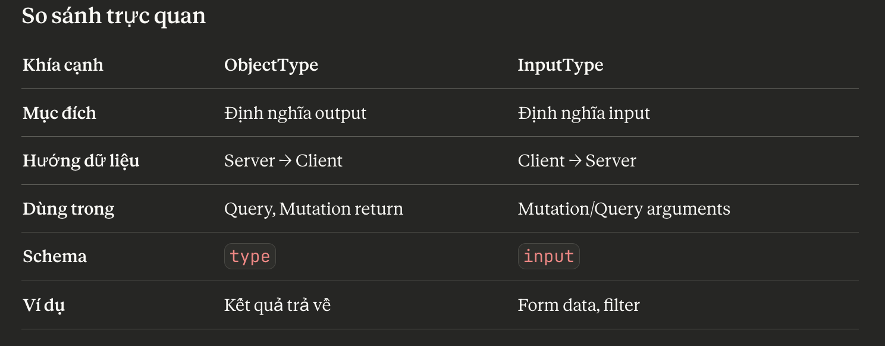

# [GraphQL](https://docs.nestjs.com/graphql/quick-start)

GraphQL là một ngôn ngữ truy vấn mạnh mẽ dành cho API và là môi trường thực thi để đáp ứng các truy vấn đó với dữ liệu hiện có của bạn. Đây là một cách tiếp cận thanh lịch giúp giải quyết nhiều vấn đề thường gặp với API REST. 


- Nest offers two way of building GraphQL app. 
  - Code first: (recommend) Bạn sử dụng decorators và các lớp TypeScript để tạo lược đồ GraphQL tương ứng.
  - Schema first: Tạo schema trước.
  

## Status code của GraphQL

Graphql sử dụng status 200 OK cho tất cả các response, kể cả khi lỗi business logic. Ví dụ thêm 1 user đã tồn tại thì GraphQL vẫn trả về 200 OK với message lỗi trong response.

Nếu câu lệnh query graphql không hợp lệ (liên quan validate graphql) thì graphql sẽ trả về 400 Bad Request.

Đây là [best practice của GraphQL được khuyên dùng](https://graphql.org/learn/serving-over-http/#status-codes).

Một số thư viện GraphQL có thể cấu hình để trả về status code khác, nhưng không được khuyến khích.

## Khi nào nên dùng GraphQL?

Ít có dự án nào chỉ dùng GraphQL, thường là kết hợp với REST API.

GraphQL phù hợp cho

- Frontend cần data flexibility
- Frontend cần Optimize bandwidth

REST API vẫn là lựa chọn tốt cho

- Authentication
- File uploads
- Caching (HTTP caching)
- Simple CRUD operations
- Third-party integrations
- Webhooks

### Tại sao Authentication vẫn nên dùng REST API?

#### 1. HTTP Status Codes

REST sử dụng HTTP status codes rõ ràng cho auth:

```ts
// REST - Rõ ràng với HTTP status
POST /auth/login
Status: 401 Unauthorized
Status: 200 OK with Set-Cookie

// GraphQL - Luôn trả về 200, phải check errors
POST /graphql
Status: 200 OK
{ "errors": [{"message": "Invalid credentials"}] }
```

#### 2. Cookie và Session Management

```ts
// REST - Dễ dàng set cookies
app.post('/auth/login', (req, res) => {
  const token = generateToken(user)
  res.cookie('token', token, { httpOnly: true, secure: true })
  res.json({ user })
})

// GraphQL - Phức tạp hơn với context
```

#### 3. Redirect Flows

Auth thường cần redirect (OAuth, SSO):

```ts
// REST - Tự nhiên với HTTP redirects
app.get('/auth/google', passport.authenticate('google'))
app.get('/auth/google/callback', passport.authenticate('google'), (req, res) =>
  res.redirect('/dashboard')
)
```

#### 4. Security Best Practices

- CSRF Protection: REST dễ implement với cookies
- Rate Limiting: Dễ rate limit theo endpoint /auth/login
- Monitoring: Dễ monitor failed login attempts
- CORS: Đơn giản hơn với specific auth endpoints

#### Tóm lại

Auth là **stateful operation** với nhiều side effects (cookies, redirects, external services), phù hợp với REST hơn GraphQL. GraphQL tốt cho data fetching, nhưng auth operations cần HTTP semantics rõ ràng.

## Validation và ORM

Nest.js GraphQL nó phù hợp với dự án Nest.js dùng

- ORM: TypeORM
- Validation: class-validator

Vì dùng chung 1 file class khai báo cho cả Schema ORM, Validation, và GraphQL.

Nhưng với sự phát triển của ORM Prisma và Validation Zod, rất nhiều dự án bây giờ dùng Prisma và Zod vì sự dễ dùng. Hiện tại khóa học **Nest.js Super** của mình cũng dùng combo Prisma và Zod.

Tiếc là hiện tại chúng ta vẫn phải khai báo riêng file dto phục vụ cho Graphql chứ không dùng chung file schema zod được.

## Flow Validate một dự án Nest.js graphql

1. Basic validate: Graphql validate

validate câu lệnh query có hợp lệ hay không

2. Validate Input: Zod validate

- Validate email có đúng định dạng hay không
- validate password có khớp hay không
- Validate name có đủ min length hay không...

3. Validate Business Logic:

- Validate email đã tồn tại hay chưa
- Validate user có tồn tại hay không

4. ORM validate


## schema.gql

- config GraphQL
```ts Ecommerce/ecom/src/app.module.ts
 GraphQLModule.forRoot<ApolloDriverConfig>({
      driver: ApolloDriver,
      graphiql: true,
      autoSchemaFile: join(process.cwd(), 'src/schema.gql'),
      sortSchema: true,
      context: ({ req, res }) => ({ req, res }),
    }),
```

```gql ecom/src/schema.gql
type Product {
  id: String!
  name: String
}
```
> Có **!** đằng sau là required, Khi client gọi bắt buộc phải truyền lên từ query của graphQL. 


- Check canActivate để xem request từ client nó là rest hay graphQL
- **ThrottlerBehindProxyGuard** sử dụng cho việc hạn chế request nhiều lần với 1 ip cụ thể.
```ts Ecommerce/ecom/src/shared/guards/throttler-behind-proxy.guard.ts
import { ThrottlerGuard } from '@nestjs/throttler'
import { ExecutionContext, Injectable } from '@nestjs/common'
import { GqlContextType } from '@nestjs/graphql'

@Injectable()
export class ThrottlerBehindProxyGuard extends ThrottlerGuard {
  canActivate(context: ExecutionContext): Promise<boolean> {
    if (context.getType<GqlContextType>() === 'graphql') {
      return Promise.resolve(true)
    }
    return super.canActivate(context)
  }

  protected getTracker(req: Record<string, any>): Promise<string> {
    console.log(req)
    return req.ips.length ? req.ips[0] : req.ip // individualize IP extraction to meet your own needs
  }
}
```


- Check GraphQL request và http request
```ts Ecommerce/ecom/src/shared/guards/access-token.guard.ts
  if (context.getType<GqlContextType>() === 'graphql') {
      // Handle GraphQL request
      const gqlContext = GqlExecutionContext.create(context)
      request = gqlContext.getContext().req
      isGraphql = true
    } else {
      request = context.switchToHttp().getRequest()
    }
```

- Bỏ qua interceptor cho GraphQL requests 
```ts Ecommerce/ecom/src/shared/interceptor/custom-zod-serializer.interceptor.ts
    const gqlContext = GqlExecutionContext.create(context)
    if (gqlContext.getType<string>() === 'graphql') {
      return next.handle()
    }
```


- Với các kiểu nguyên thủy như string, number, boolean, GraphQL có thể tự suy luận còn các kiểu khác thì không phải chỉ định rõ.
```ts Ecommerce/ecom/src/shared/graphql-entities/product.entity.ts
@ObjectType()
export class Product extends Timestamp {
  @Field(() => Int)
  id: number

  @Field(() => Date, { nullable: true })
  publishedAt: Date | null

}
```

- **InputType** và **ObjectType**: 

+ InputType: đành cho kết quả trả về
+ ObjectType: đành cho Form data, filter


