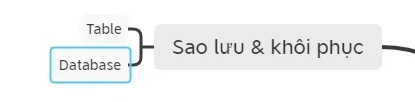

# Sử dụng SQL làm việc với PostgresSQL
[Tài liêu gốc](https://www.youtube.com/watch?v=OUlLQK_gN8k&t=1500s)
## Kiến trúc
### Kiến trúc logic 

- Database cluster: là một tập các database trên 1 postgresSQL Server
- Database là một tập hợp các Object
- Schema
- Object
  - Table
  - Index
  - Trigger
- Các database object được quản lý bởi OID
### Kiến trúc vật lý


## Sử dụng SQL

### Tạo bảng 
- Tạo bảng mới
```sql
    create table ... 
```
- Tạo bảng từ bảng khác
```sql
    create table ... as select * from ...
```

### Lấy dữ liệu trong table
- Lấy dữ liệu
  - Một hoặc nhiều cột
    ```sql
    select country_id, country_name from countries
    ```
  - tất cả các cột
    ```sql
    select * from countries
    ```

- Lọc dữ liệu
  - country_name = Italy
    ```sql
        select * from countries where country_name="Italy"
    ```
  - country_name chứa chữ a
    ```sql
        select * from countries where country_name like "%a%"
    ```
  - có thể dùng toán tử and, or
    ```sql
        select * from countries where country_name like "%a%" and country_name "%c%"
    ``` 

- Sắp xếp dữ liệu
  - desc: sắp xếp theo chiều giảm dần
    ```sql
        select * from countries where country_name like "%a%" and country_name "%c%" order by country_name desc
    ```
  - asc: sắp xếp theo chiều tăng dần
    ```sql
        select * from countries where country_name like "%a%" and country_name "%c%" order by country_name 
    ```

- Biến đổi dữ liệu
  - Sử dụng các hàm **upper**, **lower**
    ```sql
    select country_id, upper(country_name), lower(country_name)  from countries where country_name like "%a%" and country_name "%c%" order by country_name 
    ```
- Gom nhóm dữ liệu
  - Tìm ra tổng tiền lương của từng job_id.
    ```sql
    select job_id, sum(salary) from employees group by job_id
    ```

- Lấy dữ liệu từ nhiều bảng
  - inner join
    ```sql
        select e.first_name, e.last_name, d.department_name from employees e, departments d where e.department_id = d.department_id and e.first_name like '%N'
    ```


### Thêm dữ liệu trong table
- Thêm dữ liệu
    ```sql
    insert into test values (1,'A')
    ```
- Thêm dữ liệu theo đúng dữ liệu lấy ra
    ```sql
    insert into test select * from test
    ```

### Cập nhật dữ liệu trong table
- Update dữ liệu với điều kiện name = B
    ```sql
    update test set "ID"=2 where name ='B'
    ```
- Update toàn bộ dữ liệu
    ```sql
    update test set "ID"=2
    ```

### Xoá dữ liệu trong table
- Xoá dữ liệu với điều kiện ID = 2
    ```sql
    delete from test where "ID"=2
    ```
- Xoá toàn bộ dữ liệu
    ```sql
  delete from test
    ```

## Tối ưu SQL

- Đánh giá dựa trên chi phí khi thực thi 1 câu lệnh SQL.`
### Chiến lược thực thi
- Giải thích đoạn code chạy bao nhiêu
    ```sql
    explain select max(salary) from test where first_name= 'Huy'
    ```

### Thực thi chiến lược
- Đánh index
    ```sql
    create index idx_firstname on test(first_name)
    ```

## Sao lưu và khôi phục


### Sao lưu bảng

### Sao lưu database
## Các công cụ làm việc với PostgresSQL


### Sử dụng dòng lệnh
- pssql
  - kết nối database => psql -h <IP> -d <db-name> -U <username>
  - Liệt kê database => \l
  - Liệt kê tất cả table trong database => \dt
  - Xem cấu trúc của một table => \d employees
  - Liệt kê tất cả các user => \du
  - Thoát => \q

### Sử dụng đồ hoạ
- pgAdmin 4
- DBBeaver